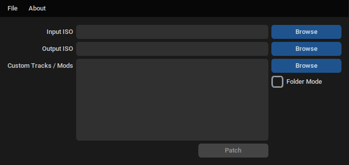

# MKDD Patcher
By Yoshi2

- New releases can be found in the **[Releases](https://github.com/RenolY2/mkdd-track-patcher/releases)** page.
- Report bugs or suggest improvements in the **[Issues](https://github.com/RenolY2/mkdd-track-patcher/issues)** page.
- Interested in MKDD modding? Check out Double Crew, a MKDD modding community: http://discord.gg/fUU36aH

The MKDD Patcher is a tool which allows users to easily import custom MKDD tracks
and other file-based mods (e.g custom drivers, or custom karts) into Mario Kart: Double Dash!!.
Patch files are specifically-created ZIP archives containing `trackinfo.ini` or `modinfo.ini`, and
all the files relating to the mod that need to be patched into the game.

Unlike difference-based patching tools like xdelta, this allows one ZIP archive to generally
work with all three main regions of MKDD (PAL, NTSC-U, NTSC-J), and multiple mods can
be patched in at once as long as the mods don't modify the same files.

# Usage
When using the Patcher, open a preferably-unmodified ISO of MKDD in the **Input ISO**.
Choose one or more MKDD mods ZIP archives that need to be patched in.
If the **Input ISO** field was empty, on choosing a MKDD ISO the **Output ISO** field
is filled in by appending `_new.iso` to the input ISO name.
Press on **Patch** to create a new ISO with the custom courses and mods patched in.



# Folder mode
By enabling **Folder Mode**, you will be able to use patches
that aren't _zipped_, and just stored in a folder. This can allow for more rapid patch development.
When choosing mods, you will then choose the folder that contains the folders of mods.
Make sure the folder you choose doesn't contain any mod you don't want.

# How to create a custom race track or custom battle stage
If you are a modder who creates custom courses for MKDD and you want to package up your custom course
into a ZIP archive so that it is compatible with the MKDD Patcher, here is what you need to do:

The structure of the ZIP archive should be like this:
```
.
├── course_images
│   └── <Language>
│       ├── track_big_logo.bti
│       ├── track_image.bti
│       ├── track_name.bti
│       └── track_small_logo.bti
├── minimap.json
├── track.arc
├── track_mp.arc
├── track_50cc.arc
├── staffghost.ght
├── lap_music_normal.ast
├── lap_music_fast.ast
└── trackinfo.ini
```
### Legend
```
<Language> ----------- Language this is for (Described below)
track_big_logo.bti --- Track logo when starting a race
track_image.bti ------ Track background image in the cup selection screen
track_name.bti ------- Track name in the cup selection screen
track_small_logo.bti - Small track, not necessary for battle stages
minimap.json --------- This file can be exported from the MKDD Track Editor and contains position/orientation data related to the minimap
track.arc ------------ Single player track arc
track_mp.arc --------- Multi player track arc
track_50cc.arc ------- Optional, 50cc variant for Luigi Circuit
track_mp_50cc.arc ---- Optional, 50cc mp variant for Luigi Circuit
staffghost.ght ------- Optional, without it no functioning staff ghost
lap_music_normal.ast - Regular tempo music, race tracks only, not for battle stages
lap_music_fast.ast --- Fast tempo music, race tracks only, not for battle stages
```

The `trackinfo.ini` file needs to contain the following data:

    [Config]
    author = Author Name
    trackname = Custom TrackName
    replaces = Replaced TrackName
    replaces_music = Replaced Track Music Name
    main_language = Language
    code_patches = Comma-separated List


with `author` and `trackname` being the name of the author and the name of the custom course respectively.
`replaces` is the name of the course being replaced and can be one of the following:

    Baby Park
    Peach Beach
    Daisy Cruiser
    Luigi Circuit
    Mario Circuit
    Yoshi Circuit
    Mushroom Bridge
    Mushroom City
    Waluigi Stadium
    Wario Colosseum
    Dino Dino Jungle
    DK Mountain
    Bowser Castle
    Rainbow Road
    Dry Dry Desert
    Sherbet Land
    Luigi's Mansion
    Nintendo Gamecube
    Block City
    Tilt-a-Kart
    Cookie Land
    Pipe Plaza

`replaces_music` is the name of the music slot being replaced and should generally be the same as the
name of the track being replaced. Battle stages are an exception, music replacement is not supported
for them at the moment so for battle stages you can leave replaces_music as None.

`main_language` is the main language that should be used for lanuages that you didn't make bti textures for. \
Example: You set `main_language` as English and you have bti textures for English.
When somebody patches your track over the PAL game then the English textures will be used for German, French,
Italian, etc.

The following languages are supported: \
English, Japanese, German, Italian, French, Spanish

`code_patches` is an optional comma-separated list of code patches that are required by the custom
track (e.g. `type-specific-item-boxes`, `sectioned-courses`, or `cpu-only-dead-zones`). This list is
informative, and will tell the Patcher that certain code patches are required.

# How to create a custom mod
This guide is for when you want to make custom drivers, custom karts or modifications to any of the
files of MKDD, including files located inside the archive files (`.arc`). Instead of replacing `.arc` files as a whole,
only specific files inside each `.arc` can be replaced which allows for multiple mods to work at the same time
as long as they don't replace the same files.

The file structure of a mod ZIP archive should be like this:

    modinfo.ini
    files/

The modinfo file should contain the following data:

    [Config]
    author = Author Name
    modname = Mod Name
    description = Mod Description

The files folder mirrors the root file folder of MKDD. Any file you want to replace needs to be put in the files folder
at a path mirroring the file you are replacing in the game. \
Example: You would like to replace the `play1.thp` cutscene which is located at `Movie/play1.thp`. That means in the ZIP archive
the file needs to be located at `files/Movie/play1.thp` (and you need to create the Movie folder in the files folder)

Replacing files inside `.arc` files works in a similar way. You create a folder named after the arc at the correct location, inside
that folder you create a folder named after the arc's root folder name and place the file you are replacing in that
folder at a path relative to the arc's root folder. \
Example: You want to replace the model of Mario which is called driver.bmd and located inside the MRAM.arc,
at location `mram/driver/mario/driver.bmd`, with mram being the root folder name of MRAM.arc. That means you create
the chain of folders in the files folder: `files/MRAM.arc/mram/driver/mario/` and put your `driver.bmd`
at `files/MRAM.arc/mram/driver/mario/driver.bmd`.

`race2d` is an exception: Because it is an `.arc` inside an `.arc` it is handled in a special way: \
You need to create the `race2d.arc` inside the files/ folder, but otherwise you can proceed like mentioned above.
(i.e. files to be replaced in `race2d.arc` would go into `files/race2d.arc/mram_race2d/...`)

Optional: If you add `addfiles = True` to the mod config, the patcher will be able to add files from the mod into the game that didn't already exist. 
This is only for advanced users who know how to make the game use new files! Currently, this cannot add new directories or new files within the archives.

# Custom Audio Waves

Mods can include custom audio waves in the top-level `audio_waves` directory. The file structure is
as follows:

```
.
├── audio_waves
│   ├── SelectVoice
│   ├── Voice
│   ├── CommendationVoice
│   ├── SoundEffects
│   ├── NintendoLogo
│   └── BGMSamples
├── files
│   └── ...
└── modinfo.ini
```

The files in these directories are `.wav` audio files (16-bit mono audio at various sample rates),
whose name include a number (e.g. `0.wav`, `1.wav`, `2.wav`, `3.wav`, ...). Every number (in each
directory) corresponds to a certain sound in the game.

For example, to replace Princess Peach's pre-selection voice and selection voice, the following
audio waves would be provided:

```
.
├── audio_waves
│   └── SelectVoice
│       ├── 35.wav     # Pre-selection voice: when the character is first selected
│       └── 36.wav     # Selection voice: when player confirms the character pair
├── files
│   └── ...
└── modinfo.ini
```

## Selection Voices

The `SelectVoice` directory features a total of 41 different sounds (from `0.wav` to `40.wav`). It
includes the pre-selection and selection voices for each character, whose mapping is:

|                | Pre-selection | Selection |
|----------------|:-------------:|:---------:|
| Mario          |       32      |     3     |
| Luigi          |       30      |     2     |
| Princess Peach |       35      |     36    |
| Daisy          |       19      |     7     |
| Yoshi          |       40      |     12    |
| Birdo          |       18      |     11    |
| Baby Mario     |       15      |     1     |
| Baby Luigi     |       14      |     13    |
| Toad           |       25      |     4     |
| Toadette       |       24      |     5     |
| Koopa          |       33      |     9     |
| Paratroopa     |       34      |     10    |
| Donkey Kong    |       22      |     21    |
| Diddy Kong     |       20      |     8     |
| Bowser         |       27      |     26    |
| Bowser Jr      |       28      |     29    |
| Wario          |       39      |     38    |
| Waluigi        |       37      |     6     |
| Petey Piranha  |       17      |     16    |
| King Boo       |       23      |     23    |

The other two sounds do not correspond to any character; they are played in the in-game menus:

| Number | Audio Content            | Description                                                                                                                                    |
|:------:|--------------------------|------------------------------------------------------------------------------------------------------------------------------------------------|
|    0   | *Welcome to Mario Kart!* | The sound that the game plays when switching between **MONO**, **STEREO**, and **SURROUND** in the **SOUND** option in the **OPTIONS** screen. |
|   31   | *Let's go!*              | The sound that the game plays when **START GAME** is entered.                                                                                  |

## In-race Voices

The `Voice` directory includes a total of 357 sounds (from `0.wav` to `356.wav`). These are the
sounds that are played during the race (sliding, attacking, hurting, falling, throwing items, etc.).
The sounds are *not* evenly distributed among the characters: some characters are assigned more
sounds than others.

The range for each character is:

|                |     Range    |    Count    |
|----------------|:------------:|:-----------:|
| Mario          | `[237, 263]` |      27     |
| Luigi          | `[212, 236]` |      25     |
| Princess Peach | `[276, 297]` |      22     |
| Daisy          | `[ 74,  98]` |      25     |
| Yoshi          | `[337, 356]` |      20     |
| Birdo          | `[ 54,  73]` |      20     |
| Baby Mario     | `[ 25,  47]` |      23     |
| Baby Luigi     | `[  0,  24]` |      25     |
| Toad           | `[163, 176]` |      14     |
| Toadette       | `[143, 162]` |      20     |
| Koopa          | `[264, 269]` |      6      |
| Paratroopa     | `[270, 275]` |      6      |
| Donkey Kong    | `[121, 138]` |      18     |
| Diddy Kong     | `[ 99, 120]` |      22     |
| Bowser         | `[177, 191]` |      15     |
| Bowser Jr      | `[192, 211]` |      20     |
| Wario          | `[317, 336]` |      20     |
| Waluigi        | `[298, 316]` |      19     |
| Petey Piranha  | `[ 48,  53]` |      6      |
| King Boo       | `[139, 142]` |      4      |

## Commendation Voices

The `CommendationVoice` directory includes a total of 139 sounds (from `0.wav` to `138.wav`). These
are the sounds that are played at the end of the race, or during the awards ceremony.

The range for each character is:

|                |     Range    |    Count    |
|----------------|:------------:|:-----------:|
| Mario          | `[ 43,  50]` |      8      |
| Luigi          | `[ 35,  42]` |      8      |
| Princess Peach | `[ 51,  58]` |      8      |
| Daisy          | `[102, 109]` |      8      |
| Yoshi          | `[ 89,  94]` |      6      |
| Birdo          | `[ 21,  27]` |      7      |
| Baby Mario     | `[  9,  16]` |      8      |
| Baby Luigi     | `[  1,   8]` |      8      |
| Toad           | `[ 59,  65]` |      7      |
| Toadette       | `[ 66,  72]` |      7      |
| Koopa          | `[110, 113]` |      4      |
| Paratroopa     | `[114, 118]` |      5      |
| Donkey Kong    | `[ 28,  34]` |      7      |
| Diddy Kong     | `[124, 128]` |      5      |
| Bowser         | `[ 17,  20]` |      4      |
| Bowser Jr      |              |             |
| Wario          | `[ 81,  88]` |      8      |
| Waluigi        | `[ 73,  80]` |      8      |
| Petey Piranha  | `[ 95, 101]` |      7      |
| King Boo       | `[119, 123]` |      5      |

Sounds that do not correspond to any character:

|     Range    | Audio Content    |
|:------------:|------------------|
| `[  0,   0]` | Crowd cheering   |
| `[129, 138]` | Pianta sounds    |

## Sound Effects

The `SoundEffects` directory includes a total of 182 sounds (from `0.wav` to `181.wav`). These
are the miscellaneous sound effects that are played during the race: item sounds, car honk
sounds, ambient sounds, terrain sounds, course-specific sounds, etc.

Note: 
 "1-4" means 1,2,3,4
 "1/4" means 1,4
 "?" marks sound effects that are unknown of use in game. If you know a sound's use, 
 please remove ? and clarify in description if you can.

|  Range |      Audio Content    | ? |
|:------:|-----------------------|---|
|   0-1  | Final Lap             |   |
|   2-3  | Starman Music         |   |
|   4-5  | Chain Chomp Music     |   |
|  6/100 | Pipe Enter&Exit       |   |
|     7  | Engine                | ? |
|     8  | Synth Beat            | ? |
|     9  | Engine                | ? |
|    10  | Plastic Click         | ? |
|    11  | Gunshot Explosion     | ? |
|    12  | RoboBowser Fire       |   |
|  13-31 | Horns                 |   |
|    32  | Plastic Click         | ? | 
|    33  | Fence Floor           | ? |
|    34  | Ship Horn             |   |
|    35  | Bowser Laugh          |   |
|    36  | Sci-fi Warp Noise     | ? |
|    37  | Shine Sprite          |   |
|    38  | Engine                | ? |
|    39  | Wood Road             | ? |
|    40  | Dial Noise            | ? |
|    41  | Mountain Surface      |   |
|    42  | Lava                  | ? |
|    43  | Firey Sound           | ? |
|    44  | Lightning             |   |
|    45  | Waterstream           | ? |
|    46  | Slosh                 | ? |
|    47  | Thunder               | ? |
|    48  | Jet Plane             | ? |
|    49  | Water Plop            | ? |
|    50  | Fire                  | ? |
|    51  | Lightning             | ? |
|    52  | Bowling Pins Hit      |   |
|    53  | Driving Skrt          | ? |
|    54  | Driving               | ? |
|    55  | Chain Chomp Chains    |   |
|    56  | Driving               | ? |
|    57  | Metal Thud            | ? |
|    58  | Dense Metal Thud      | ? |
|    59  | Dense Metal Thud      | ? |
|    60  | Mud                   | ? |
|    70  | Chain Chomp Bark      |   |
|    85  | Crowd Clapping        | ? |
|    86  | People on Rollercoast | ? |
|    89  | Stars Twinkling RR    |   |
|    92  | Dinosaur Ambience DDJ |   |
|    93  | Koopa Shell Bump      |   |
|    97  | Crowd                 | ? |
| 103-104| Boat Horns            | ? |
|   108  | Coin                  |   | 
|   114  | Dinosaur Scream DDJ   |   | 
|   120  | Failure Noise         | ? | 
|   135  | N64 Boo Laugh         | ? |
| 159-165| Male Noki             |   |
| 166-181| Male Pianta           |   |


## Nintendo Logo

The `SoundEffects` directory includes a total of 2 sounds (`0.wav` and `1.wav`):

| Number | Audio Content          | Description                         |
|:------:|------------------------|-------------------------------------|
|    0   | *Niiiiiinteeeendoooo!* | The first part of the intro sound.  |
|    1   | *Yoo-hoo!*             | The second part of the intro sound. |

## Background Music Samples

The `BGMSamples` directory includes a total of 121 sounds (from `0.wav` to `120.wav`). These
are the samples for each of the instruments that are played in the background music. This only applies
for certain songs such as the title screen or main menu, as many of the game's songs are either streamed as
.ats or part of the sound effect library.

Note: 
 "1-4" means 1,2,3,4
 "1/4" means 1,4
Instruments are only described to what they closely sound like


|  Range |        Samples        |
|:------:|-----------------------|
|   0-13 | Trumpet               |
|  14-19 | Drum                  |
|  20-22 | Horn                  |
|    23  | Honk                  | 
|  24-28 | Guitar                | 
|    29  | Horn                  |
|  30-32 | Straws                |
|  33-34 | Cymbal                |
|  35-36 | Synth                 |
|  37-42 | Xylophone             |
|  43-48 | Saxophone             |
|    49  | Bell                  |
|  50-54 | Saxophone             | 
|  55-56 | Whistle               | 
|  57-60 | Choir                 | 
|    61  | Drum                  | 
|  62-64 | Cymbal                | 
|  65-66 | Drum                  | 
|    67  | Bass Guitar           | 
|  68-71 | Church Piano          | 
|  72-76 | Cymbal                |
|  77-79 | Bass Drum             |
|  80-85 | Piano                 |
|  86-87 | Choir                 |
|  88-91 | Church Piano          |
|  92-94 | Saxophone             |
|  95-96 | Synth                 |
|  97-101| Trumpet               |
| 102-109| Bass                  |
|    110 | Cymbal                |
| 111-114| Choir                 |
| 115-120| Horn                  |

> [!NOTE]
> The first time that the Patcher applies a mod that includes custom audio waves to an ISO, a copy
> of the retail audio waves will be preserved in `<system's temp dir>/mkdd-retail-audio-waves`. The
> absolute path to the directory is logged in the console.
>
> Modders can listen to the retail `.wav` files to acquire a sense of the audio clips that are going
> to be replaced (duration, audio content, sample rate, etc.).

# Baking Cheat Codes

Mods can include a companion cheat codes file that contains Action Replay / Gecko codes. The file
must be placed next to the `modinfo.ini` or `trackinfo.ini` file. Depending on the region, the name
of the file is:

- `cheatcodes_US.ini`
- `cheatcodes_PAL.ini`
- `cheatcodes_JP.ini`
- `cheatcodes_US_DEBUG.ini`

Normally, mods should provide a cheat codes file for each region, so that the mod exhibits the same
behavior regardless of the input ISO that the user chooses.

Cheat codes will be baked directly into the DOL file; no code handler will be installed. The
supported code types are:

- `00______ ________` 8-bit write and fill (only single-byte writes)
- `02______ ________` 16-bit write and fill
- `04______ ________` 32-bit write
- `06______ ________` String write

Cheat codes must be provided in their unencrypted form; the encrypted `____-____-_____` form that is
often used in Action Replay codes is not supported. Lines that do no start with an alphanumeric
character will be ignored (e.g. lines starting with `$`, `*`, or  `[...]`).

Conflicts can be produced when two or more mods feature cheat codes that happen to write different
values to the same memory address. When a conflict is detected during the build, a warning is
issued, prompting the user to either abort or continue the build process.

> [!NOTE]
> Cheat codes are often developed with the assumption that a code handler will be installed in the
> game. Since MKDD Patcher does not install a code handler, it is possible some cheat codes do not
> function as expected. The only way to verify whether a certain cheat code is supported is to test
> it.

# Switching tracks to different track slots
Sometimes you might have two custom tracks that go over the same track slot. In that case, without
manual intervention, it's not possible to play both at once. In that case check the trackinfo.ini inside
one of the ZIP archives: replaces and replaces_music will need to be modified to a different track slot.
Note that some track slots in the game have hardcoded behaviour, e.g. crowd chants in Waluigi Stadium.


# Technical details
The MKDD Patcher does cool stuff to improve the custom track playing experience:
1) The transformation of driver positions into a position on the minimap is normally hardcoded but
the Patcher can patch that for every track slot and region of MKDD assuming the `minimap.json` is correct. (Should there
be a case where the patching is wrong, let me know)
2) If a custom track is moved to a different slot than it was intended for, the hardcoded minimap scaling and
offset is modified so that the minimap won't clip outside of the screen boundary or leak onto the timer or speedometer.
3) For custom race tracks, the `GCKart.baa` file is patched so that every race track in the game has a unique music track instead
of sharing the same music. (Battle stages are excluded from this, their music ID is hardcoded to play the same music unless you
assign a music ID from a race track to them in the MKDD Track Editor)


# Running from source code
- Get the source code of the Patcher from https://github.com/RenolY2/mkdd-track-patcher.
- Install Python 3 version 3.10 or newer, install the Python requirements (see `requirements.txt`), and run `mkdd_patcher.py` with it. Alternatively, execute `run.bat` if running on Windows.
